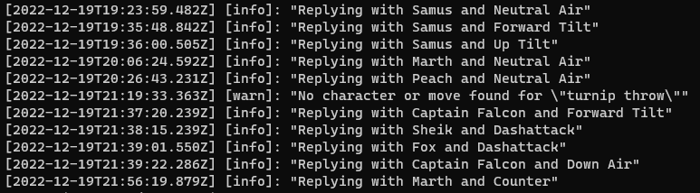

# FightCore Privacy Policy

This document is intended to provide information on how the FightCore Discord bot
treats your data and shows how it is used.

FightCore is concerned about the users privacy and tries to be as transparent as
possible. If there is anything within this privacy policy that you have questions
about or would want to see changed. Please feel free to contact us directly.

## What data is collected

FightCore does not collect any personal identifying information.
FightCore keeps record of the moves and/or characters that have been requested using
the bot. This information log does not include any user-written content, only
the names of the objects that have been requested.

FightCore does keep track of not-found moves and/or characters. This is done by
logging the content that was requested without any information about the user
or guild where this message occurred in.

The following is an image of the logs on the server where FightCore is hosted:

## How is this data used

The logs are used to improve the bot and monitor usage. For example, the data is
sometimes aggregated to provided statistics on how often a certain character and/or
move has been requested.

The not-found moves and/or character logs are used to improve the alias and search
systems. If a search term is common but returns a wrong result, it may be added
as an alias.

## Who has access to this data

The logs are stored within the Docker container FightCore runs in. This container
does not have a volume and is removed when updating the bot to a new version.
Meaning only people who have access to the FightCore server have access to the data.
Currently this is and will only be Bort. Access to the aggregated statistics may
be given to a third party for further usage (like visualisation). If this happens,
the provided data will be searched for any user-created content and removed.

## Deleting of data

The log data is removed when updating the Discord bot to a new version, releases
do not have a schedule and may differ in time frame. If an user wants to request
the deletion of log statements for any reason, they can request it by contacting
any of the accounts mentioned in the `Questions` section

## Questions

If you have any questions or are concerned about what data is collected or processed
by FightCore. Feel free to contact us through one of the following channels:

- [Our support Discord server](https://discord.gg/v7sRWTM)
- [@FightCoregg on Twitter](https://www.twitter.com/FightCoregg)
- Email to bort@fightcore.gg
- Bort#9703 on Discord

If you do not receive a reply from any of the FightCore accounts, please do feel
free to contact me (Bort) personally on Discord. I'm more active on there.

## Updates

Updates to the privacy policy will be tracked by Git and hosted by GitHub.
If you are inexperienced with viewing a Git history, please feel free to contact
us for your information.
